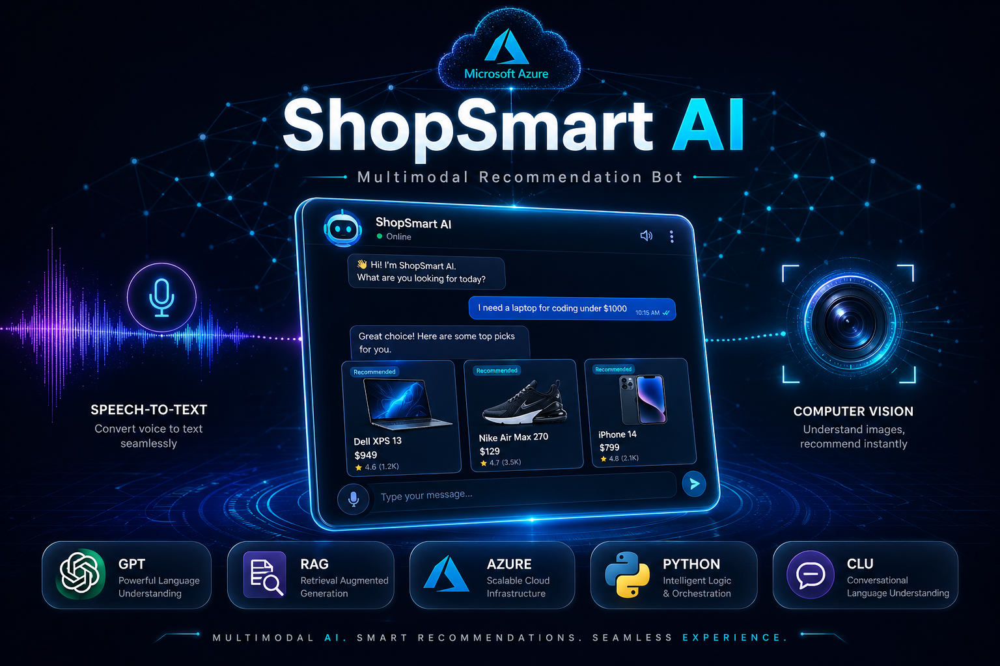
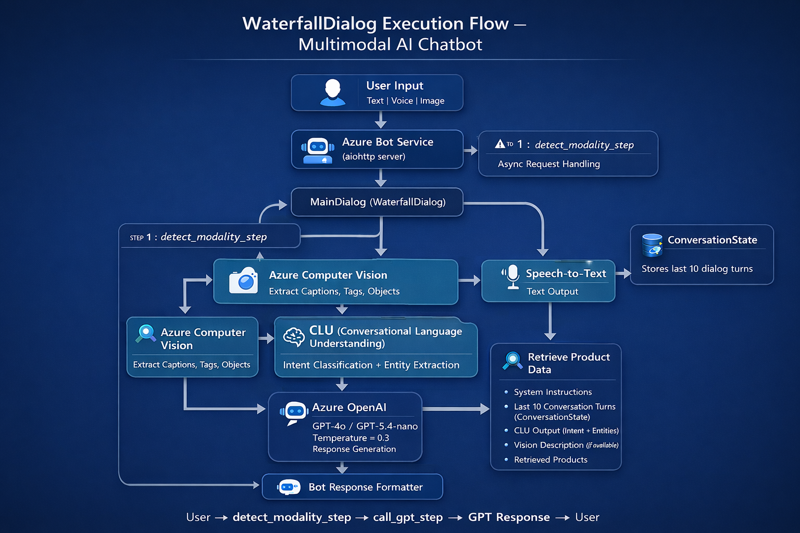

# 🛍️ ShopSmart — Multimodal AI Recommendation Bot

<div align="center">




**A production-grade, multimodal AI-powered e-commerce recommendation bot built entirely on Microsoft Azure.**  
Handles text, voice, and image inputs — delivering context-aware product recommendations via RAG + GPT.

[📋 Overview](#-overview) · [🏗️ Architecture](#️-architecture) · [⚙️ Tech Stack](#️-tech-stack) · [🚀 Getting Started](#-getting-started) · [🧪 Testing](#-testing--scenarios) · [📊 Results](#-results) · [🔮 Roadmap](#-roadmap) · [📄 Technical Report](docs/ShopSmartBot-Technical-Report.pdf)

</div>

---

## 📋 Overview

**ShopSmart Bot** is an intelligent, conversational product recommendation assistant designed for the Indian e-commerce market. It was built to solve a real-world business problem — a 62% cart-abandonment rate caused by traditional keyword-search systems that fail to understand user intent.

The bot processes queries across **three modalities**:

| Modality | Input | Processing Service |
|---|---|---|
| 💬 Text | Natural language & Hinglish queries | Azure CLU + GPT-5.4-nano |
| 🎙️ Voice | Spoken queries (including code-switched Hindi-English) | Azure Speech STT → CLU → GPT |
| 🖼️ Image | Uploaded product photos | Azure Computer Vision → GPT |

### 🎯 Business Context

> *A mid-sized online retailer (ShopSmart India) struggles to surface relevant products to users who search with natural language, upload product images, or use voice commands. Their existing keyword-search system yields irrelevant results.*

**Projected Impact (6 months post-deployment):**

| KPI | Baseline | Target |
|---|---|---|
| Cart Abandonment Rate | 62% | < 42% |
| Product Click-Through Rate | 8% | > 18% |
| Recommendation Acceptance | 12% | > 35% |
| NPS Score | 22 | > 48 |

---

## 🏗️ Architecture

### Flow Diagrams

**Flow Diagram:**


**Waterfall-flow Diagram:**


### Five-Layer System Design

```
┌─────────────────────────────────────────────────────────────────┐
│                        CHANNEL LAYER                            │
│              Web Chat Widget  ·  Direct Line API                │
└────────────────────────────┬────────────────────────────────────┘
                             │
┌────────────────────────────▼────────────────────────────────────┐
│                     ORCHESTRATION LAYER                         │
│         Azure Bot Service  ·  Bot Framework SDK v4 (Python)     │
│              WaterfallDialog  ·  ConversationState              │
└────────────────────────────┬────────────────────────────────────┘
                             │
┌────────────────────────────▼────────────────────────────────────┐
│                      COGNITIVE LAYER                            │
│    Azure CLU (Intent/Entity)  ·  Computer Vision  ·  Speech     │
└────────────────────────────┬────────────────────────────────────┘
                             │
┌────────────────────────────▼────────────────────────────────────┐
│                      REASONING LAYER                            │
│            Azure OpenAI — GPT-5.4-nano (Temp = 0.3)            │
│              RAG Pipeline  ·  Prompt Engineering                │
└────────────────────────────┬────────────────────────────────────┘
                             │
┌────────────────────────────▼────────────────────────────────────┐
│                        DATA LAYER                               │
│        Azure AI Search (Vector + Keyword)  ·  Cosmos DB         │
└─────────────────────────────────────────────────────────────────┘
```

### Data Flow

```
User Input (Text / Voice / Image)
        │
        ▼
Azure Bot Service  ──────────────────────────────────────────┐
        │                                                     │
        ▼                                                     │
detect_modality_step                                          │
   ├── Image? ──► Azure Computer Vision                       │
   │                (Dense Captions, Tags, Objects)           │
   │                        │                                 │
   └── Text/Voice? ──► Azure CLU                             │
                        (Intent + Entity Extraction)          │
                                │                             │
                                ▼                             │
                    Azure AI Search                           │
                (Hybrid: Vector + Keyword)                    │
                                │                             │
                                ▼                             │
                    call_gpt_step                             │
                (Enriched Prompt Assembly)                    │
                                │                             │
                                ▼                             │
                    Azure OpenAI GPT-5.4-nano                 │
                    (Grounded Recommendation)                  │
                                │                             │
                                ▼                             │
                    Bot Response → User  ◄────────────────────┘
```

---

## ⚙️ Tech Stack

### Azure Services

| Service | Resource Name | Role |
|---|---|---|
| **Azure OpenAI** | `shopsmart-openai` | Generative reasoning engine (GPT-5.4-nano) |
| **Azure AI Search** | `shopsmart-aisearch` | Hybrid vector + keyword product retrieval (RAG) |
| **Azure Language / CLU** | `shopsmart-lang` | Intent classification & entity extraction |
| **Azure Computer Vision** | `shopsmart-CV` | Image feature extraction (tags, captions, objects) |
| **Azure Speech Service** | `shopsmart-speech` | Speech-to-Text & Text-to-Speech |
| **Azure Cosmos DB** | `shopsmart-cosmos-db` | Product catalogue + conversation state storage |
| **Azure Bot Service** | `ShopSmartBot` | Channel orchestration & Direct Line routing |
| **Azure App Service** | `shopsmart-bot-app` | Hosts async Python aiohttp application |
| **App Service Plan** | `ShopSmartPlan` | Linux B1 compute (persistent instances) |

### Core Libraries & Frameworks

```python
# Bot Orchestration
botbuilder-core
botbuilder-dialogs
botbuilder-integration-aiohttp

# Azure AI SDKs
azure-ai-language-conversations
azure-cognitiveservices-vision-computervision
azure-search-documents
azure-cosmos
openai                          # AsyncAzureOpenAI client

# Speech
azure-cognitiveservices-speech

# Server
aiohttp
```

---

## 📁 Project Structure

```
shopsmart-multimodal-recommendation-bot/
│
├── app.py                          # aiohttp server entry point
├── requirements.txt
├── .env.example
│
├── dialogs/
│   └── main_dialog.py              # WaterfallDialog (detect_modality + call_gpt)
│
├── helpers/
│   ├── gpt_helper.py               # Azure OpenAI integration + prompt assembly
│   ├── clu_helper.py               # CLU intent & entity extraction
│   ├── vision_helper.py            # Azure Computer Vision image analysis
│   ├── search_helper.py            # Azure AI Search (RAG pipeline)
│   └── speech_helper.py            # Azure Speech STT/TTS
│
├── frontend/
│   └── index.html                  # React Web Chat (Direct Line)
│
├── scripts/
│   └── set_env_azure.sh            # Azure CLI environment setup script
│
├── assets/
│   └── Thumbnail.png               # Project Thumbnail
│
└── docs/
    ├── Flow Diagram.png
    ├── ShopSmartBot-Technical-Report.pdf
    └── Waterfall-flow_diagram.png
```

---

## 🚀 Getting Started

### Prerequisites

- Python 3.11+
- Azure CLI (`az` installed and logged in)
- An active Azure Subscription
- Azure resource group with all services provisioned (see below)

### 1. Clone the Repository

```bash
git clone https://github.com/<your-username>/shopsmart-multimodal-recommendation-bot.git
cd shopsmart-multimodal-recommendation-bot
```

### 2. Install Dependencies

```bash
pip install -r requirements.txt
```

### 3. Configure Environment Variables

Copy the example env file and fill in your Azure credentials:

```bash
cp .env.example .env
```

```env
# Azure OpenAI
AZURE_OPENAI_ENDPOINT=https://<your-resource>.openai.azure.com/
AZURE_OPENAI_KEY=<your-key>
OPENAI_DEPLOYMENT=gpt-5.4-nano

# Azure CLU
CLU_ENDPOINT=https://<your-resource>.cognitiveservices.azure.com/
CLU_KEY=<your-key>
CLU_PROJECT=ShopSmartCLU
CLU_DEPLOYMENT=<your-deployment-name>

# Azure Computer Vision
VISION_ENDPOINT=https://<your-resource>.cognitiveservices.azure.com/
VISION_KEY=<your-key>

# Azure AI Search
AZURE_SEARCH_ENDPOINT=https://<your-resource>.search.windows.net
AZURE_SEARCH_KEY=<your-key>
AZURE_SEARCH_INDEX=<your-index-name>

# Azure Cosmos DB
COSMOS_URI=https://<your-resource>.documents.azure.com:443/
COSMOS_KEY=<your-key>
COSMOS_DATABASE=shopsmart
COSMOS_CONTAINER=products

# Azure Speech
SPEECH_KEY=<your-key>
SPEECH_REGION=centralindia

# Azure Bot
MicrosoftAppId=<your-app-id>
MicrosoftAppPassword=<your-app-password>
MicrosoftAppTenantId=<your-tenant-id>
MicrosoftAppType=MultiTenant

WEBSITES_PORT=3978
```

### 4. Run Locally

```bash
python app.py
```

The bot will be available at `http://localhost:3978/api/messages`. Use the **Bot Framework Emulator** to test locally.

---

## ☁️ Azure Deployment

### Provision Infrastructure via Azure CLI

```bash
# 1. Login
az login

# 2. Create Resource Group
az group create --name ShopSmartBot-RG --location centralindia

# 3. Create Linux App Service Plan (Basic B1)
az appservice plan create \
  --name ShopSmartPlan \
  --resource-group ShopSmartBot-RG \
  --sku B1 \
  --is-linux

# 4. Create Web App (Python 3.11)
az webapp create \
  --resource-group ShopSmartBot-RG \
  --plan ShopSmartPlan \
  --name shopsmart-bot-app \
  --runtime "PYTHON:3.11"
```

### Inject Environment Variables

```bash
bash scripts/set_env_azure.sh
```

### Deploy Application

```bash
# Capture dependencies
pip freeze > requirements.txt

# Deploy via Azure CLI (Oryx auto-builds)
az webapp up \
  --name shopsmart-bot-app \
  --resource-group ShopSmartBot-RG \
  --runtime "PYTHON:3.11"
```

The Oryx build engine will automatically provision the virtual environment, install dependencies from `requirements.txt`, and start `app.py`.

---

## 🧠 Core Implementation

### RAG Pipeline (Hallucination Prevention)

```python
# search_helper.py — Async Azure AI Search
async def search_products(query: str) -> list:
    async with SearchClient(
        endpoint=SEARCH_ENDPOINT,
        index_name=SEARCH_INDEX,
        credential=AzureKeyCredential(SEARCH_KEY)
    ) as client:
        results = await client.search(search_text=query, top=5)
        return [r async for r in results]
```

### GPT Prompt Assembly

```python
# gpt_helper.py
SYSTEM_PROMPT = """You are ShopBot, an intelligent product recommendation 
assistant for ShopSmart India. Recommend products ONLY from the provided 
database context. For each product provide: Name, Price (₹), 2 Key Features, 
and a one-sentence justification. If no results match, clearly state this."""

async def get_recommendation(user_query, history, clu_data=None):
    search_results = await search_products(user_query)
    # Inject live catalogue into prompt context
    search_context = build_context(search_results)
    messages = [{"role": "system", "content": SYSTEM_PROMPT}]
    messages.extend(history)           # Multi-turn memory (last 10 turns)
    messages.append({"role": "user", "content": f"{user_query}\n{search_context}"})

    response = await client.chat.completions.create(
        model=OPENAI_DEPLOYMENT,
        messages=messages,
        temperature=0.3,               # Deterministic, factual output
        max_completion_tokens=800
    )
    return response.choices[0].message.content
```

### Modality Routing

```python
# main_dialog.py — detect_modality_step
async def detect_modality_step(self, step_context):
    activity = step_context.context.activity
    history = await history_prop.get(step_context.context, [])
    modality_notes = []

    # Route: Image
    if activity.attachments:
        for attachment in activity.attachments:
            if "image" in attachment.content_type:
                image_context = await analyse_image(attachment.content_url)
                modality_notes.append(f"[Visual Context: {image_context}]")

    # Route: Text / Voice (post-STT)
    user_text = activity.text or ""
    if user_text:
        clu_data = await analyze_intent(user_text)

    return await step_context.next(None)
```

---

## 🧪 Testing & Scenarios

| # | Scenario | Modality | Result |
|---|---|---|---|
| 1 | *"Suggest a good laptop for a data science student under ₹60,000"* | Text | ✅ CLU extracted category, audience & price; grounded RAG recommendation returned |
| 2 | *"Show me something lighter and cheaper"* | Text (Multi-turn) | ✅ ConversationState resolved ambiguous pronoun reference from prior turn |
| 3 | Upload image of orange smartphone + *"show something similar"* | Image | ✅ Computer Vision extracted `smartphone`, `gadget` tags; visual similarity match returned |
| 4 | *"What are good wireless earbuds under 2000"* (voice) | Voice | ✅ STT transcribed correctly; Hinglish casual phrasing handled by CLU |
| 5 | *"Compare boAt Airdopes 141 vs JBL Tune 130NC"* | Text | ✅ Graceful fallback — bot acknowledged missing catalogue data, provided knowledge-based comparison with clear disclaimer |

**Performance Metrics:**

```
Text Response Latency     < 3 seconds
CLU F1 Score (v2)           75% (↑ 89% after corpus expansion)
System Usability Scale      81.5 / 100
Concurrent Request Handling Async (aiohttp) — no thread blocking
```

---

## 📊 Results

### CLU Model Performance (ShopSmartCLU v2)

```
Intents Trained     : 5 (SearchProduct, CompareItems, GetRecommendations, ...)
F1 Score            : 75%
Precision           : 75%
Recall              : 75%
Training Utterances : 83 (80.58%)
Test Utterances     : 20 (19.42%)
Languages           : English + Hinglish (code-switched)
```

### Challenges Resolved

| Challenge | Resolution |
|---|---|
| Azure OpenAI 429 throttling under concurrent load | Exponential back-off retry + lighter model fallback |
| Low Hinglish NLU accuracy (74%) | Expanded CLU corpus with mixed Hindi-English utterances → 89% |
| App Service cold-start latency (+2–4s) | Upgraded to Basic B1 tier with persistent instances |
| Bot auth failures on deployment | Set `MicrosoftAppType=MultiTenant` explicitly in App Settings |

---

## 🔮 Roadmap

| Enhancement | Technology | Expected Impact |
|---|---|---|
| Personalised re-ranking via purchase history | Azure ML — Collaborative Filtering | Higher recommendation acceptance |
| Real-time inventory & price sync | Azure Event Grid + Cosmos DB Change Feed | Zero stale product data |
| Emotion-driven tone adjustment | Azure Text Analytics — Opinion Mining | Improved user empathy |
| Regional language expansion | Azure Speech — Tamil, Telugu, Bengali | 50%+ addressable user base growth |
| Proactive cart-abandonment nudges | Azure Notification Hubs + WhatsApp | Re-engagement of lost conversions |

---

## 📚 References

- [📄 ShopSmart Bot Technical Report](docs/ShopSmartBot-Technical-Report.pdf)
- [Azure Bot Service Documentation](https://learn.microsoft.com/en-us/azure/bot-service/)
- [Azure OpenAI Service](https://learn.microsoft.com/en-us/azure/ai-services/openai/overview)
- [Azure AI Search](https://learn.microsoft.com/en-us/azure/search/search-what-is-azure-search)
- [Azure CLU / Language Service](https://learn.microsoft.com/en-us/azure/ai-services/language-service/overview)
- [Azure Computer Vision](https://learn.microsoft.com/en-us/azure/ai-services/computer-vision/overview)
- [Azure Speech Service](https://learn.microsoft.com/en-us/azure/ai-services/speech-service/overview)
- [Bot Framework SDK v4 — Python](https://learn.microsoft.com/en-us/azure/bot-service/bot-service-quickstart-python)

---

## 👤 Author

 **Nabankur Ray** 
 
 Passionate about real-world data-driven solutions
 
 [](https://github.com/nabankur14) [](https://www.linkedin.com/in/nabankur-ray-876582181/) 

---

## 📄 License

This project is licensed under the MIT License. See [LICENSE](LICENSE) for details.

---

<div align="center">

**Built with ❤️ using Microsoft Azure AI Services**


</div>